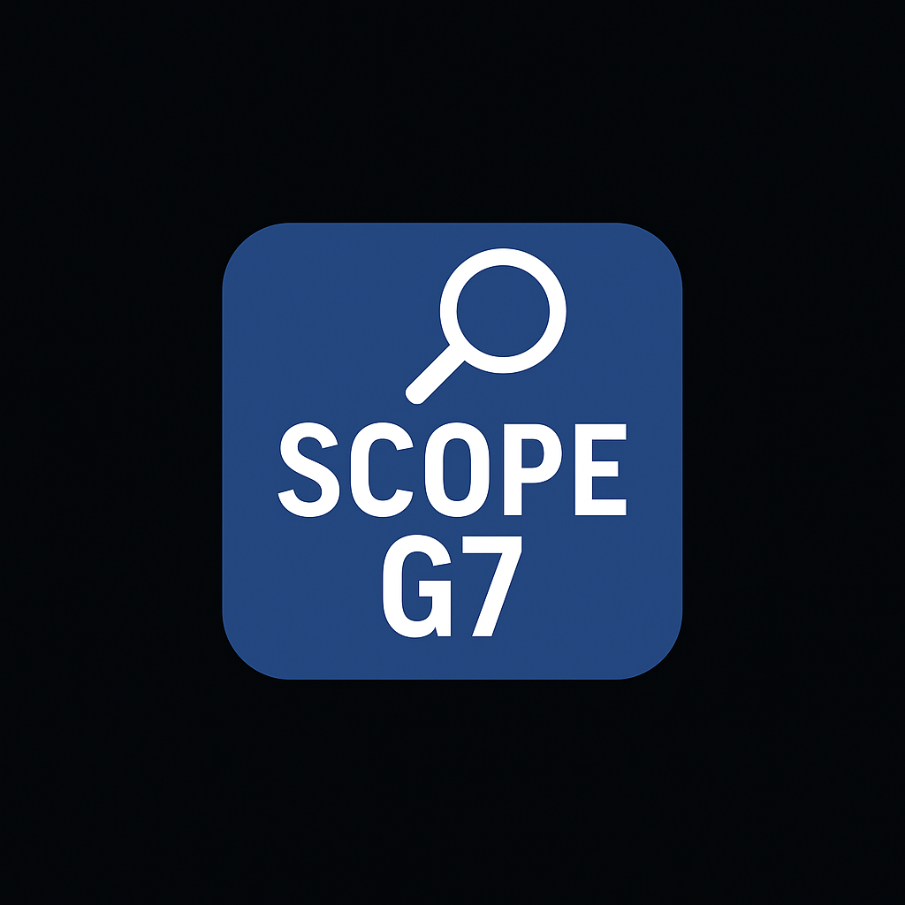

# 🚀 Scope Your Project – Gruppe 7

[](https://josh37237.github.io/demo-17-11-25/)


---

<p align="center">
  
</p>

---

## 🎯 Willkommen

Willkommen zum Repository der **Gruppe 7** des Moduls *Scope Your Project (HSLU)*.  
Dieses Projekt behandelt **Releases & Change Management** – also den gesamten Lebenszyklus von Software-Releases:  
Versionierung, Change Control (CHANGELOG/Release Notes), sowie Deployment-Strategien (Phased, Feature Flags, Rollback).


---

## 📘 Inhalt
- [Überblick](#-überblick)
- [Releases & Change Management](#-releases--change-management)
- [Lokales Setup](#-lokales-setup)
- [Projektstruktur](#-projektstruktur)
- [Team](#-team)
- [Technologien](#-technologien)
- [Changelog](#-changelog)
- [Lizenz](#-lizenz)

---

## 🧩 Überblick

Das Projekt simuliert und dokumentiert, wie Software-Releases professionell geplant, umgesetzt und verwaltet werden.

Im Fokus stehen:
- Automatisierte Versionierung *(Semantic Versioning, Git Tags, Release Notes)*
- Change Control über **CHANGELOG** & Release Management
- Deployment-Strategien mit *Phasing, Feature Flags & Rollback*

**Projektressourcen:**
- 📄 [Dokumentation (Pages)](https://hslu-exercise.github.io/scope-your-project-gruppe_7)
- 📘 [GitHub Wiki](https://github.com/HSLU-Exercise/scope-your-project-gruppe_7/wiki)
- 🧾 [CHANGELOG.md](./CHANGELOG.md)

---

## ⚙️ Lokales Setup

Führe folgende Befehle im Terminal aus, um das Projekt lokal zu klonen und auszuführen:

### Repository klonen
```bash
git clone https://github.com/HSLU-Exercise/scope-your-project-gruppe_7.git
cd scope-your-project-gruppe_7
```

### Abhängigkeiten installieren (je nach Projekttechnologie)
```bash
npm install     # Node.js
```
oder
```bash
pip install -r requirements.txt  # Python
```

### Lokale Entwicklungsumgebung starten
```bash
npm run dev
```
oder
```bash
python app.py
```

---

## 🧱 Projektstruktur
```bash
scope-your-project-gruppe_7/
├── .github/              # CI/CD Workflows
├── docs/                 # MkDocs / Dokumentation
├── CHANGELOG.md          # Änderungsverlauf
├── mkdocs.yml            # MkDocs-Konfiguration
├── README.md             # Diese Datei
└── src/                  # (optional) Beispielcode oder Simulation
```

---

## 👥 Team

| Name | Rolle | Beschreibung |
|------|--------|--------------|
| **Ulrich Luca** | 🧭 Product Owner | Verantwortlich für Vision, Anforderungen & Abnahme der Releases |
| **Nikola Loosli** | ⚙️ Scrum Master | Moderiert Prozesse, fördert Teamflow & koordiniert Sprints |
| **Nando Brauchli** | 🧠 Release Manager / DevOps | Verantwortlich für Versionierung, CI/CD Workflows, Automation & Dokumentation |
| **Joshua Lipp** | 💻 Technical Writer / Change Coordinator | Dokumentiert Change Requests, pflegt Changelog & Wiki-Struktur |
| **André Bucheli** | 🧩 QA Engineer / Tester | Testet Deployments, validiert Rollbacks und Release-Stabilität |

---

## 🧾 Releases & Change Management

### 🔖 Version Management
- Semantic Versioning *(1.0.0 → Major.Minor.Patch)*
- Automatisierte Release Notes via GitHub Actions
- Nutzung von Tags zur Release-Kennzeichnung  

### 🔄 Change Control
- Automatisierter **CHANGELOG.md**
- Release Schedule Management
- Kommunikation mit Stakeholdern über Wiki / Pages  

### 🚀 Deployment Strategien
- Phased Deployment *(App-Rollout in Etappen)*
- Feature Flags *(z. B. Beta-Features aktivieren/deaktivieren)*
- Rollback Capabilities *(Downgrade bei Fehlern)*

---

## 🧮 Technologien

- **Git & GitHub Actions** – CI/CD und automatisierte Releases  
- **MkDocs** – Projektdokumentation (Deploy auf Pages)  
- **Markdown** – Strukturierte Doku und Wiki-Texte  
- **Python / Node.js** – Simulation von Release-Automatisierungen  

---

## 📜 Changelog

Siehe [CHANGELOG.md](./CHANGELOG.md)

**Beispiel:**
```markdown
# Changelog
## [1.0.0] – 2025-10-16
- Initiale Struktur erstellt (README, Pages, Wiki)
- Teamrollen definiert
- Basisdokumentation aufgebaut
```

---

## ⚖️ Lizenz

© 2025 HSLU – Scope Your Project (Gruppe 7)  
Dieses Projekt dient ausschließlich zu Lern- und Demonstrationszwecken.

